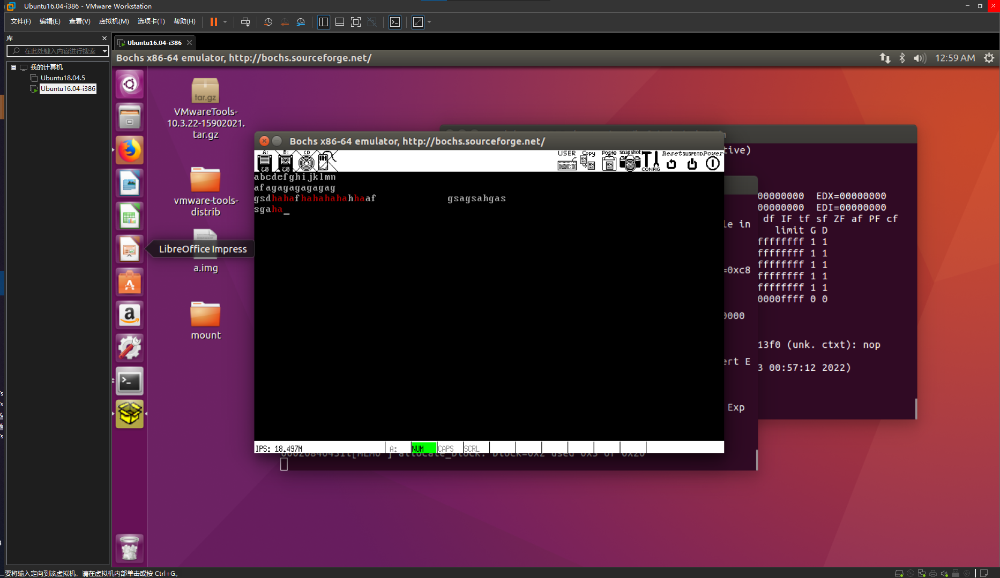
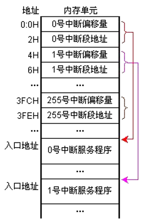

# 计算机与操作系统实验三-实验报告

## 实验环境

- Ubuntu 16.04-i386

修改 `Makefile` 中的如下变量以适应环境：

```makefile
ASMKFLAGS = -I include/ -f elf32
CFLAGS = -I include/ -c -fno-builtin -m32 -fno-stack-protector
LDFLAGS = -s -Ttext $(ENTRYPOINT) -m elf_i386
```

## 实验功能

1. 可以输入并显示 `a-z,A-Z` 和 `0-9` 字符（光盘代码功能）
2. 大小写切换包括 Shift 组合键以及大写锁定两种方式（光盘代码功能）
3. 支持回车键换行（光盘代码实现部分）
4. 支持用退格键删除输入内容（光盘代码功能）
5. 支持空格键（光盘代码功能）
6. 支持 Tab 键
7. 每隔 20 秒左右, 清空屏幕。输入的字符重新从屏幕左上角开始显示（时间间隔硬编码）
8. 要求有光标显示, 闪烁与否均可, 但⼀定要跟随输入字符的位置变化（光盘代码功能）
9. 支持屏幕滚动翻页，输入字符数无上限
10. 查找功能
11. 附加功能：撤销操作

## 实验截图



## 实验问题

### 解释中断向量

对应每个中断源设置一个向量。这些向量顺序存在主存储器的特定存储区。向量的内容是**相应中断服务程序的起始地址和处理机状态字**。在响应中断时，由中断系统硬件提供向量地址，处理机根据该地址取得向量，并转入相应的中断服务程序。

### 解释中断类型码

我们把每个中断服务程序进行编号，这个号就代表一个中断服务程序，就是**中断类型码**。这个中断类型码是计算机用来查找中断向量用的。

中断指令的一般格式为 `INT n`，其中，n 被称为“中断类型码”。


### 解释中断向量表

中断向量表是指**中断服务程序入口地址的偏移量与段基值**，一个中断向量占据 4 字节空间。中断向量表是 8086 系统内存中最低端 1K 字节空间，它的作用就是按照中断类型号从小到大的顺序存储对应的中断向量，总共存储 256 个中断向量。

- 中断向量表在内存单元的最低处，地址空间为 `00000H----003FFH(0-1024B)`。
- 这个地址正好和中断类型码有一种对应的关系：中断类型码*4（一个中断向量所占的空间）就等于这个中断向量的首地址。
- 每一个中断向量所包含的地址以低位二字节存储偏移量，高位二字节存储段地址；
- 中断类型号×4=存放中断向量的首地址；
- 按照实模式的寻址方式找到对应的中断处理的入口；
- 在全部 256 个中断中，前 32 个（0—31）为硬件系统所预留，后 224 个可由用户自定义；



### 实模式下中断程序地址如何得到？

根据中断类型码 n，从中断向量表中取得中断处理程序地址，取得的段地址存入 CS，偏移量存入 IP。从而使 CPU 转入中断处理程序运行。

### 保护模式下中断程序地址如何得到？

在保护模式下，为每一个中断和异常定义了一个中断描述符，来说明中断和异常服务程序的入口地址的属性。由中断描述符表取代实地址模式下的中断向量表。

### 中断向量的地址如何得到？

中断类型号×4=存放中断向量的首地址

### 实模式下如何根据中断向量的地址得到中断程序地址？

根据中断类型码 n，从中断向量表中取得中断处理程序地址，取得的段地址存入 CS，偏移量存入 IP。从而使 CPU 转入中断处理程序运行。

### 解释中断描述符

在保护模式下，为每一个中断和异常定义了一个中断描述符，来说明中断和异常服务程序的入口地址的属性。

- 由中断描述符表取代实地址模式下的中断向量表
- 中断描述符除了含有中断处理程序地址信息外，还包括许多属性和类型位
- 每个中断描述符占用连续的 8 个字节，中断描述符分为三类：任务门、中断门和自陷门，CPU 对不同的门有不同的处理方式

低地址的 0 和 1 两个字节是中断代码的偏移量 A15～A0； 高地址的 6 和 7 两个字节是中断代码的偏移量 A31～A16；

2 和 3 两个字节是段选择符，段选择符和偏移量用来形成中断服务子程序的入口地址；

4 和 5 两个字节称为访问权限字节，它标识该中断描述符是否有效、服务程序的特权级和描述符的类型等信息；

- P（present）：表示中断描述符的有效性；
- DPL（descriptor privilege level）；
- TY/image-20221124113440199.png)

### 保护模式下中断描述符表如何得到？

### 保护模式下中断门如何得到？

### 保护模式下如何根据中断门得到中断处理程序地址？

### 中断的分类，举例不同类型的中断？

### 中断与异常的区别？

### 实模式和保护模式下的中断处理差别

### 如何识别键盘组合键（如 Shift+a）是否还有其他解决方案？

### IDT 是什么，有什么作用？

### IDT 中有几种描述符？

### 异常的分类？

### 用户态和内核态的特权级分别是多少？

### 中断向量表中，每个中断有几个字节？里面的结构是什么？

### 中断异常共同点（至少两点），不同点（至少三点）