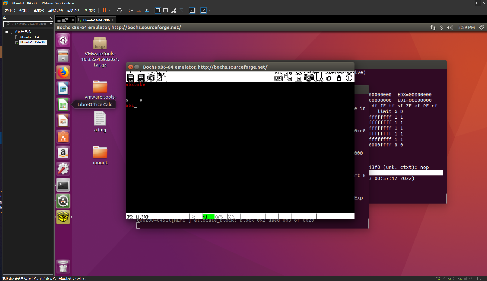

# 计算机与操作系统实验三-实验报告

## 实验环境

- Ubuntu 16.04-i386

修改 `Makefile` 中的如下变量以适应环境：

```makefile
ASMKFLAGS = -I include/ -f elf32
CFLAGS = -I include/ -c -fno-builtin -m32 -fno-stack-protector
LDFLAGS = -s -Ttext $(ENTRYPOINT) -m elf_i386
```

## 实验功能

1. 可以输入并显示 `a-z,A-Z` 和 `0-9` 字符（光盘代码功能）
2. 大小写切换包括 Shift 组合键以及大写锁定两种方式（光盘代码功能）
3. 支持回车键换行（光盘代码实现部分）
4. 支持用退格键删除输入内容（光盘代码功能）
5. 支持空格键（光盘代码功能）
6. 支持 Tab 键
7. 每隔 20 秒左右, 清空屏幕。输入的字符重新从屏幕左上角开始显示（时间间隔硬编码）
8. 要求有光标显示, 闪烁与否均可, 但⼀定要跟随输入字符的位置变化（光盘代码功能）
9. 支持屏幕滚动翻页，输入字符数无上限
10. 查找功能
11. 附加功能：撤销操作

## 实验截图



## 实验问题

### 解释中断向量

对应每个中断源设置一个向量。这些向量顺序存在主存储器的特定存储区。向量的内容是**相应中断服务程序的起始地址和处理机状态字**。在响应中断时，由中断系统硬件提供向量地址，处理机根据该地址取得向量，并转入相应的中断服务程序。

### 解释中断类型码

我们把每个中断服务程序进行编号，这个号就代表一个中断服务程序，就是**中断类型码**。这个中断类型码是计算机用来查找中断向量用的。

中断指令的一般格式为 `INT n`，其中，n 被称为“中断类型码”。


### 解释中断向量表

中断向量表是指**中断服务程序入口地址的偏移量与段基值**，一个中断向量占据 4 字节空间。中断向量表是 8086 系统内存中最低端 1K 字节空间，它的作用就是按照中断类型号从小到大的顺序存储对应的中断向量，总共存储 256 个中断向量。

- 中断向量表在内存单元的最低处，地址空间为 `00000H----003FFH(0-1024B)`；
- 这个地址正好和中断类型码有一种对应的关系：中断类型码*4（一个中断向量所占的空间）就等于这个中断向量的首地址；
- 每一个中断向量所包含的地址以**低位二字节存储偏移量，高位二字节存储段地址**；
- 中断类型号×4=存放中断向量的首地址；
- 按照实模式的寻址方式找到对应的中断处理的入口；
- 在全部 256 个中断中，前 32 个（0~31）为硬件系统所预留，后 224 个可由用户自定义；


### 实模式下中断程序地址如何得到？

根据中断类型码 n，从中断向量表中取得中断处理程序地址，取得的段地址存入 CS，偏移量存入 IP。从而使 CPU 转入中断处理程序运行。

### 保护模式下中断程序地址如何得到？

在保护模式下，为每一个中断和异常定义了一个**中断描述符**，来说明**中断和异常服务程序的入口地址**的属性。由中断描述符表取代实地址模式下的中断向量表。

### 中断向量的地址如何得到？

中断类型号×4=存放中断向量的首地址

### 实模式下如何根据中断向量的地址得到中断程序地址？

根据中断类型码 n，从中断向量表中取得中断处理程序地址，取得的段地址存入 CS，偏移量存入 IP。从而使 CPU 转入中断处理程序运行。

### 解释中断描述符

在保护模式下，为每一个中断和异常定义了一个中断描述符，来说明中断和异常服务程序的入口地址的属性。

- 由中断描述符表取代实地址模式下的中断向量表；
- 中断描述符除了含有中断处理程序地址信息外，还包括许多属性和类型位；
- 每个中断描述符占用连续的 **8 个字节**（中断向量是 4 个字节），中断描述符分为三类：**任务门、中断门和自陷门**，CPU 对不同的门有不同的处理方式

中断描述符的结构：

- 低地址的 0 和 1 两个字节是中断代码的偏移量 A~15~～A~0~；
-  高地址的 6 和 7 两个字节是中断代码的偏移量 A~31~～A~16~；
- 2 和 3 两个字节是段选择符，段选择符和偏移量用来形成中断服务子程序的入口地址；
- 4 和 5 两个字节称为访问权限字节，它标识该中断描述符是否有效、服务程序的特权级和描述符的类型等信息；
	- P（present）：表示中断描述符的有效性；
	- DPL（descriptor privilege level）；
	- TYPE：指示中断描述符的不同类型


### 保护模式下中断描述符表如何得到？

在 80x86 系列中为中断服务提供中断/陷阱描述符，这些描述符构成中断描述符表（IDT）

- 引入一个 48 位的全地址寄存器（即中断描述符表寄存器 IDTR）存放 IDT 的内存地址，因此不再限于底部 1K 位置
- 和 GDTR 一样，IDTR 包含 32 位的基地址和 16 位段限，基地址定义 IDT 在存储器中的起始点，段限定义中断描述符表所占的字节个数
- 理论上 IDT 表同样可以有 8K 项，可是因为 80x86 只支持 256 个中断，因此 IDT 实际上最大只能有 256 项（2K 大小）

### 保护模式下中断门如何得到？

查中断描述符表，以 IDTR 指定的中断描述符表的基地址为起始地址，用调用号 N×8 算出偏移量，即为 N 号中断门描述符的首地址，由此处取出中断门的 8 个字节。

### 保护模式下如何根据中断门得到中断处理程序地址？

查全局或局部描述符表根据中断门中的选择子（段选择符）和偏移量得到中断处理程序入口。


### 中断的分类，举例不同类型的中断？

从中断源的角度分类：

1. 由计算机硬件异常或故障引起的中断，也称为**内部异常中断**。
2. 由程序中执行了**中断指令**引起的中断，也称为**软中断**。由程序员通过 INT 或 INT3 指令触发，通常当做 trap 处理，用处：实现系统调用。
3. 外部设备（如输入输出设备）请求引起的中断，也称为**外部中断**或 I/O 中断。

### 中断与异常的区别？

- 中断：由 CPU 以外的事件引起的中断，如 I/O 中断、时钟中断、控制台中断等；
- 异常：来自 CPU 的内部事件或程序执行中的事件引起的过程。如由于 CPU 本身故障、程序故障和请求系统服务的指令引起的中断等。

共同点：

1. 都是程序执行过程中的强制性转移，转移到相应的处理程序；
2. 都是软件或者硬件发生了某种情形而通知处理器的行为。

区别：

1. 产生的原因：中断，是 CPU 所具备的功能。通常因为“硬件”而随机发生。异常，是“软件”运行过程中的一种开发过程中没有考虑到的程序错误。
2. 设计逻辑上：中断是 CPU 暂停当前工作，有计划地去处理其他的事情。中断的发生一般是可以预知的，处理的过程也是事先制定好的。处理中断时程序是正常运行的。异常是 CPU 遇到了无法响应的工作，而后进入一种非正常状态。异常的出现表明程序有缺陷。
3. 中断是异步的，异常是同步的：中断是来自处理器外部的 I/O 设备的信号的结果，它不是由指令流中某条指令执行引起的，从这个意义上讲，它是异步的，是来自指令流之外的。 异常是执行当前指令流中的某条指令的结果，是来自指令流内部的，从这个意义上讲它们都（？）是同步的。
4. 中断或异常的返回点：良性的如中断和 trap，只是在正常的工作流之外执行额外的操作，然后继续干没干完的活。因此处理程序完了后返回到原指令流的下一条指令，继续执行。 恶性的如 fault 和 abort，对于可修复 fault，由于是在上一条指令执行过程中发生（是由正在执行的指令引发的）的，在修复 fault 之后，会重新执行该指令；至于不可修复 fault 或 abort，则不会再返回。
5. 发生的状态不同：中断是由于当前程序无关的中断信号触发的，CPU 对中断的响应是被动的，且与 CPU 模式无关。既可以发生在用户态，又可以发生在核心态。 异常是由 CPU 控制单元产生的，大部分异常发生在用户态。

### 实模式和保护模式下的中断处理差别

最大区别在于寻找中断处理代码入口的方式——实模式下，中断处理程序的入口地址称为“中断向量”，所有的“中断向量”存储在⼀个“中断向量表”中；而保护模式下，为每⼀个中断和异常定义了⼀个中断描述符，来说明中断和异常服务程序的入口地址的属性，由中断描述符表取代实地址模式下的中断向量表。

### 如何识别键盘组合键（如 Shift+a）是否还有其他解决方案？

光盘代码已经实现，在 `keyboard.c` 中 155 行开始，监视 `SHIFT_L, SHIFL_R, CAPS_LOCK` 等按键的状态并调整字母的大小写情况。

### IDT 是什么，有什么作用？

参见 [4.9 保护模式下中断描述符表如何得到？](#保护模式下中断描述符表如何得到？)

### IDT 中有几种描述符？

中断描述符分为三类：任务门描述符、中断门描述符和自陷门描述符

### 异常的分类？

1. Fault，是一种可被更正的异常，而且一旦被更正，程序可以不失连续性地继续执行。返回地址是产生 fault 的指令。
2. Trap，一种在发生 trap 的指令执行之后立即被报告的异常，它也允许程序或任务不失连续性地继续执行。返回地址是产生 trap 的指令之后的那条指令。
3. Abort，不总是报告精确异常发生位置的异常，不允许程序或任务继续执行，而是用来报告严重错误的。

### 用户态和内核态的特权级分别是多少？

当中断发生在用户态（特权级为 3），而中断处理程序运行在内核态（特权级为 0），特权级发生了变化，所以会引起堆栈的更换。也就是说，从用户堆栈切换到内核堆栈。

### 中断向量表中，每个中断有几个字节？里面的结构是什么？

每个中断向量包含 4 Bytes。

低地址两个 Byte 放偏移，高地址两个 Byte 放段描述符，最多 256 个中断向量。

### 中断异常共同点（至少两点），不同点（至少三点）

参见 [4.13 中断与异常的区别？](#中断与异常的区别？)